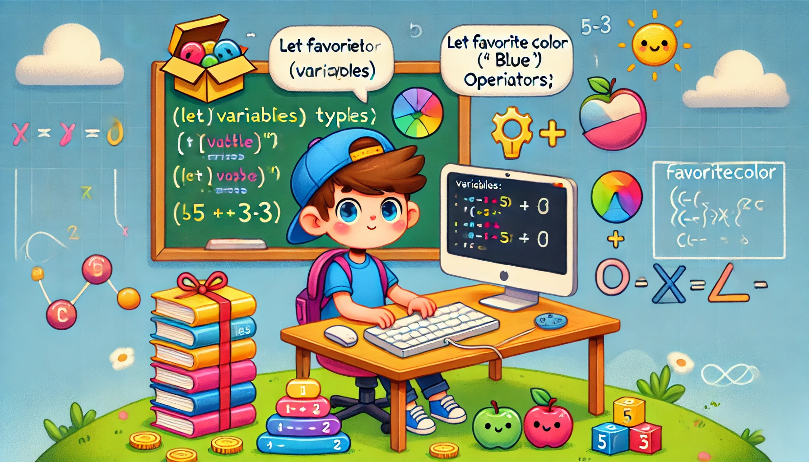

🌟 Season 2: Programming Fundamentals 🌟

Welcome to the exciting world of programming! This week, we’re starting with the fundamentals that form the backbone of every coding language. By the end of this week, you’ll have a strong understanding of some key concepts and the confidence to write your very first programs. 🚀

# 🖥️ Week 1: Introduction to Programming Concepts

Welcome, young coders! 🎉 This week, we’re going to learn the magical language of computers called programming. Imagine you’re a wizard, and the code you write is like spells that make the computer do whatever you want (within reason, of course)! 🪄 Let’s dive into the basics and have some fun!

## 1️⃣ What is Programming?

Programming is like giving instructions to your computer to get it to do something. It’s like telling your robot friend how to bake a cake or play a game—but you have to be very clear and specific because computers don’t guess!

## 2️⃣ Variables, Data Types, and Operators

### Variables

A variable is like a treasure chest where you can store something important. You give it a name so you can find it later.

Example:

```
let favoriteColor = "blue";  // Store your favorite color
let numberOfApples = 5;     // Store the number of apples you have
```

💡 Imagine a box labeled “Favorite Color” with “blue” written inside it—that’s your variable!

### Data Types

Data types are the different kinds of treasures you can put in your variable chests.  
	1.	Strings (Text)  
	•	A string is just text, like “Hello!” or “Pizza is awesome.”  
	•	How to Use:
```
let message = "Coding is fun!";
console.log(message); // Output: Coding is fun!
```  

2.	Numbers  
•	Numbers can be whole (like 5) or have decimals (like 3.14). You use them for math!  
•	How to Use:
```
let price = 20;
let quantity = 3;
console.log(price * quantity); // Output: 60
```

3.	Booleans (True/False)  
•	These are like yes-or-no answers. For example, “Is it raining?” could be true or false.  
•	How to Use:

```
let isRaining = false;
console.log(isRaining); // Output: false
```


	4.	Arrays (Lists)  
	•	An array is like a shopping list where you can keep many items in one place.  
	•	How to Use:  

```
let fruits = ["Apple", "Banana", "Cherry"];
console.log(fruits[0]); // Output: Apple
```
More about Arrays is below, please read it carefully since it is fundamental data type for storing and manipulating data!

### Operators

Think of operators as the tools you use to work with your treasures:  
	1.	Arithmetic Operators (Math Tools)  
	•	Add: +  
	•	Subtract: -  
	•	Multiply: *  
	•	Divide: /  
Example:

```
let a = 10, b = 2;
console.log(a + b); // Output: 12
console.log(a * b); // Output: 20
```


2.	Comparison Operators  
•	These compare two things and tell you if something is true or false.  
•	Examples: >, <, ==, !=  

```
let age = 18;
console.log(age >= 18); // Output: true
```


3.	Logical Operators  
•	Combine conditions, like “Do I have an umbrella AND is it raining?”  
•	Examples: and (&&), or (||), not (!)

```
let hasUmbrella = true, isRaining = true;
console.log(hasUmbrella && isRaining); // Output: true
```

## 3️⃣ Control Structures: Loops and Conditionals

### Conditionals (If Statements)

These are like decision-makers. If one thing is true, do this; otherwise, do that.

Example:

```
let temperature = 15;
if (temperature > 20) {
    console.log("It's warm outside!");
} else {
    console.log("It's chilly, wear a jacket.");
}
```

### Loops

Loops help you repeat something again and again without getting tired. Think of it like pressing a “replay” button!
	1.	For Loop (Counted Repetition)
	•	Use this when you know how many times you want to repeat something.

```
for (let i = 1; i <= 5; i++) {
    console.log("Hello, world! " + i);
}
// Output: Hello, world! 1, Hello, world! 2, ..., Hello, world! 5
```


2.	While Loop (Until It’s Done)  
•	Use this when you don’t know exactly how many times you need to repeat.

```
let balloons = 5;
while (balloons > 0) {
    console.log("Pop! " + balloons);
    balloons--;
}
// Output: Pop! 5, Pop! 4, ..., Pop! 1
```

## 4️⃣ Exercise Time!

💻 You can try these exercises right in your browser! Press F12, go to the Console tab, and type your code. Hit Enter to see the magic happen!

Exercise 1: Favorite Snack
	•	Create a variable to store your favorite snack.
	•	Print it out using console.log().

Exercise 2: Simple Math
	•	Create variables for the price of a chocolate bar and how many you want to buy.
	•	Calculate the total cost and display it.

Exercise 3: Decision Time
	•	Write a program that checks the weather. If it’s raining, print “Take an umbrella!” Otherwise, print “Enjoy the sunshine!”

Exercise 4: Loop Fun
	•	Use a for loop to print the numbers 1 to 10.
	•	Use a while loop to count backward from 5 to 0, printing each number.

🌟 Keep Going! 🌟

Learning to code is like learning a new language—it’s a journey, not a sprint. Every step you take, no matter how small, is progress. Sometimes things won’t make sense right away, and that’s perfectly okay! You’re planting seeds of knowledge, and with time and effort, those seeds will grow into strong skills. 🌱

Remember, even the best coders started where you are now. The key is to stay curious, keep experimenting, and never give up. Mistakes aren’t failures—they’re stepping stones to success.

You’ve got this, young coders! Every line of code you write is building your magic. ✨ Let’s keep creating, learning, and growing together! 🚀

## Further readings:
* [Javascript - Типы данных](https://learn.javascript.ru/types)
* [Javascript - Логические операторы](https://learn.javascript.ru/logical-operators)
* [Javascript - Операторы сравнения](https://learn.javascript.ru/comparison)
* [Javascript - if...else](https://learn.javascript.ru/ifelse)
* [Javascript - Циклы while и for](https://learn.javascript.ru/while-for)

## Arrays: Lists of Items

An array is like a magic shelf where you can store multiple items in an organized way. Each item has its own position (called an index) so you can find it quickly.

### Indexes

Indexes are like labels for each item on the shelf, and they start at 0, not 1!

Example:

```
let fruits = ["Apple", "Banana", "Cherry"];
```

Here’s what the array looks like:
```
Index	Item
0	“Apple”
1	“Banana”
2	“Cherry”
```

You can use the index to get a specific item:
```
console.log(fruits[0]); // Output: Apple
console.log(fruits[2]); // Output: Cherry
```
If you try to use an index that doesn’t exist, you’ll get undefined:
```
console.log(fruits[3]); // Output: undefined
```
### What Can You Do with Arrays?
1.	Add Items  
You can add a new item to the end of an array using .push():
```
fruits.push("Orange");
console.log(fruits); // Output: ["Apple", "Banana", "Cherry", "Orange"]
```

2.	Remove Items  
Use .pop() to remove the last item:
```
fruits.pop();
console.log(fruits); // Output: ["Apple", "Banana", "Cherry"]
```

3.	Change Items  
Replace an item by assigning a new value to its index:
```
fruits[1] = "Grape";
console.log(fruits); // Output: ["Apple", "Grape", "Cherry"]
```

4.	Find the Length  
Use .length to check how many items are in the array:
```
console.log(fruits.length); // Output: 3
```

5.	Loop Through Items  
You can use a loop to go through every item in an array:
```
for (let i = 0; i < fruits.length; i++) {
    console.log(fruits[i]);
}
// Output: Apple, Grape, Cherry
```

Arrays are super helpful for storing lists like groceries, tasks, or even player scores in a game. They’re one of the most powerful tools in your coding toolbox! 🚀