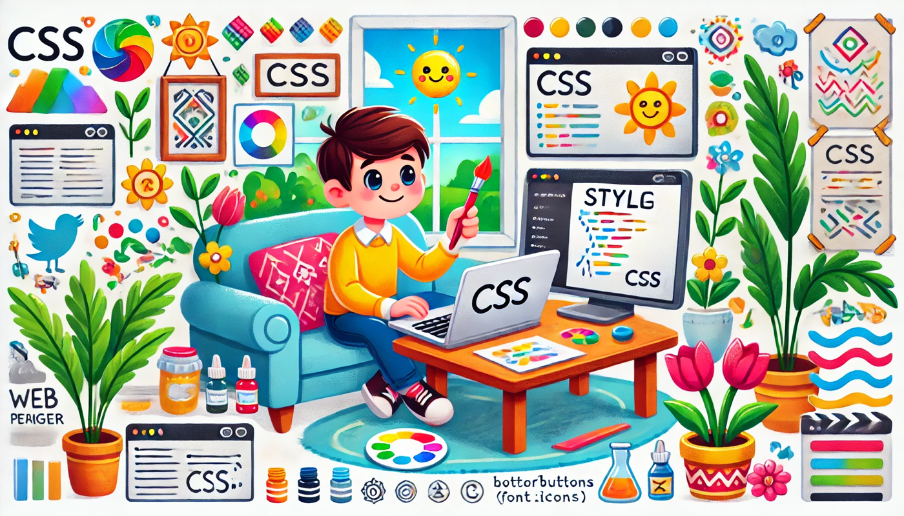

# 👩‍💻 Неделя 2: CSS — Стилизация Веба  
*#css #frontend #webdevelopment*

На прошлой неделе ты создал(а) свою первую веб-страницу с помощью HTML. Но давай честно — один только HTML выглядит как из начала 2000-х 😅  
Пора добавить *стиль* и вдохнуть жизнь в свою страницу! Добро пожаловать в **CSS** — язык, который делает сайты красивыми.

---

## 🌟 Что такое CSS?

CSS расшифровывается как **Cascading Style Sheets** (каскадные таблицы стилей).  
Если HTML определяет структуру страницы (заголовки, абзацы, изображения), то **CSS определяет внешний вид** — как эти элементы *выглядят*.

С помощью CSS можно:
- Задавать цвета и фоны 🎨
- Выбирать шрифты и стили текста ✍️
- Добавлять отступы, границы и выравнивание 📐
- Создавать макеты и адаптивный дизайн 🧱

---

## 🧩 Как применять CSS?

Есть **3 основных способа добавить CSS на страницу**:

### 1. Встроенные стили — прямо внутри HTML-элементов  
👉 Используется только для быстрой проверки. Не рекомендуется для реальных проектов.
```html
<h1 style="color: red;">Привет, мир!</h1>
```

2. Встроенный CSS — внутри тега `<style>` в HTML-файле

👉 Подходит для небольших проектов или примеров.

```html
<head>
  <style>
    h1 {
      color: blue;
    }
  </style>
</head>
```

3. Внешний CSS-файл — лучшая практика ✅

👉 Позволяет отделить стили от структуры и переиспользовать их.

В index.html:
```html
<link rel="stylesheet" href="styles.css">
```
В styles.css:
```css
h1 {
  color: green;
}
```

🎨 Основные концепции CSS

✅ Селекторы

Они определяют, что вы стилизуете.
- h1, p, div — селекторы по тегу
- .className — селектор по классу
- #idName — селектор по ID

Пример:
```css
/* Стилизовать все абзацы */
p {
  font-size: 16px;
}
```

✅ Свойства и значения

Они задают, *как* стилизовать элементы.

Пример:
```css
body {
  background-color: #f0f0f0; /* светло-серый фон */
  color: #333;              /* тёмный текст */
}
```

✏️ Типографика и стилизация текста
```css
p {
  font-family: Arial, sans-serif;
  font-size: 18px;
  font-weight: bold;
  text-align: justify;
}
```
Можно использовать:
- font-family: задаёт шрифт
- font-size: размер в пикселях, rem или %
- font-weight: normal, bold и т.д.
- text-align: left, right, center, justify

🌈 Цвета и фоны
```css
body {
  background-color: #ffffff;
  color: #111111;
}

button {
  background-color: #4CAF50;  /* зелёный */
  color: white;
}
```
Можно использовать:
- Именованные цвета: red, blue
- Шестнадцатеричные коды: #FF5733
- RGB/rgba: rgba(0,0,0,0.5)

📐 Box Model: Отступы, поля и границы

Каждый элемент — это "коробка". Вот как это выглядит:
```
+--------------------------+
|        Margin            |
|  +--------------------+  |
|  |     Border         |  |
|  |  +--------------+  |  |
|  |  |   Padding    |  |  |
|  |  |  +--------+  |  |  |
|  |  |  | Content | |  |  |
|  |  |  +--------+  |  |  |
|  |  +--------------+  |  |
|  +--------------------+  |
+--------------------------+
```
Пример:
```css
.card {
  margin: 20px;
  padding: 10px;
  border: 2px solid black;
}
```

🧱 Основы вёрстки

✅ Центрирование контента
```css
.container {
  width: 600px;
  margin: 0 auto; /* центрирование по горизонтали */
}
```

✅ Flexbox (современный инструмент вёрстки)
```css
.flex-container {
  display: flex;
  justify-content: space-between;
  align-items: center;
}
```

Flexbox позволяет легко создавать адаптивные и выровненные макеты.

🧠 Итоги

CSS позволяет превратить обычную HTML-страницу в современную, читаемую и уникальную.

Теперь ты знаешь, как:
- Добавлять стили разными способами
- Использовать цвета, шрифты, отступы и инструменты вёрстки
- Визуально организовывать контент

📚 Домашнее задание
1. Создай HTML-страницу с:
- Заголовком и 2–3 абзацами текста
- Изображением и кнопкой

2. Добавь отдельный CSS-файл и оформи:
- Цвет фона и шрифт
- Заголовки (цвет, размер шрифта)
- Отступы и выравнивание абзацев
- Изображение (граница или тень)
- Кнопку (эффект при наведении, отступы)

3. Бонус-челлендж 💡:
- Используй Flexbox, чтобы разместить элементы рядом
- Добавь контейнер с рамкой и отступами

Играйте с цветами и макетами — сделай страницу *своей* 🎨
