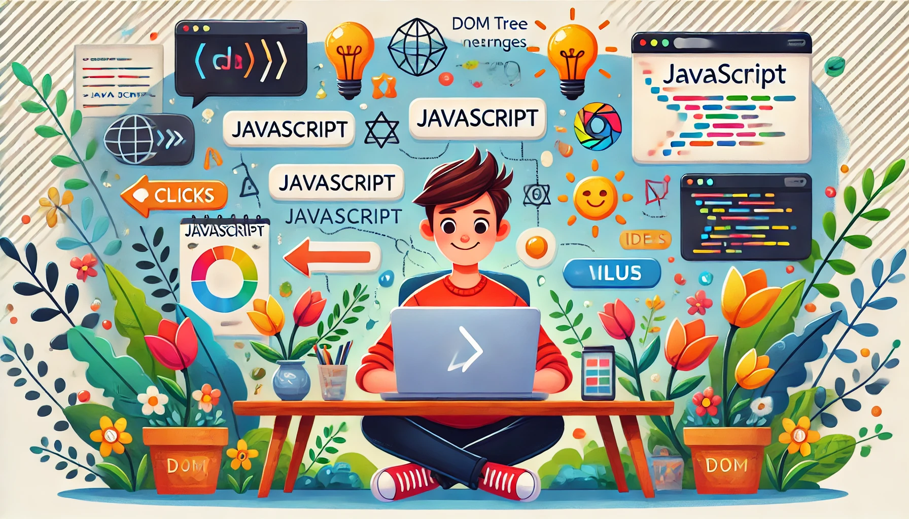

# ⚙️ Week 3: JavaScript Basics
*#javascript #frontend #webdevelopment*

You've built the structure with HTML.  
You've added style with CSS.  
Now it’s time to bring your webpage to life with **JavaScript** 🧠💥

You have already known the JavaScript basics from the previous weeks.
But for the sake of clarity, we will go through the basics again.
JavaScript (JS) is the language of interactivity on the web. With it, you can:
- Make buttons respond when clicked ✅  
- Change text dynamically ✅  
- Show or hide elements ✅  
- Create games, animations, and apps ✅

---

## 🧠 What is JavaScript?

JavaScript is a **programming language** that runs in the browser.  
It allows your webpage to **react** to user actions — like clicks, typing, or scrolling.

> Think of JavaScript as the "brain" of your page — making decisions and updating things based on what the user does.

---

## ✍️ How to Add JavaScript to a Webpage

You can write JavaScript in two ways:

### 1. Inside the HTML file
```html
<script>
  alert("Welcome to my website!");
</script>
```

### 2. External `.js` file (Best practice)
```html
<script src="script.js"></script>
```

Inside `script.js`:
```js
console.log("Page loaded!");
```

---

## 🧩 JavaScript Syntax: The Basics

### ✅ Variables – Storing data
```js
let name = "Amina";
const year = 2025;
```

- `let` is for variables that can change  
- `const` is for constants (unchangeable)  
- `var` is outdated — avoid it in modern JS

---

### ✅ Functions – Reusable blocks of code
```js
function greet() {
  alert("Hello there!");
}

greet(); // call the function
```

With parameters:
```js
function greet(name) {
  console.log("Hi, " + name + "!");
}

greet("Amina"); // Output: Hi, Amina!
```

---

### ✅ Events – Interact with the user
```html
<button onclick="sayHi()">Click me!</button>

<script>
  function sayHi() {
    alert("Hello from the button!");
  }
</script>
```

---

## 🌱 What is the DOM?

DOM = **Document Object Model**  
It’s a *tree-like structure* of your webpage. JavaScript can "walk the tree" and **change elements** on the fly.
- **Elements**: HTML tags (like `<p>`, `<div>`, etc.)
- **Attributes**: Properties of elements (like `id`, `class`, etc.)
- **Text**: The content inside elements
- **Styles**: CSS properties (like `color`, `font-size`, etc.)
- **Events**: User actions (like clicks, key presses, etc.)
- **Nodes**: Everything in the DOM is a node (elements, text, comments)
- **Parent/Child**: Elements can have parents and children (like a family tree)


### Example: Change Text with JS
```html
<p id="greeting">Hello!</p>
<button onclick="changeText()">Change text</button>

<script>
  function changeText() {
    document.getElementById("greeting").innerText = "You clicked the button!";
  }
</script>
```

---

## 🛠 Common DOM Methods

| Task         | JavaScript Code                             |
|--------------|----------------------------------------------|
| Get element  | `document.getElementById("id")`              |
| Change text  | `element.innerText = "new text"`             |
| Change HTML  | `element.innerHTML = "<b>bold!</b>"`         |
| Change style | `element.style.color = "blue"`              |
| Show/hide    | `element.style.display = "none" / "block"`  |

---

## 🎮 Example: Counter App
```html
<h2 id="counter">0</h2>
<button onclick="increase()">+</button>
<button onclick="reset()">Reset</button>

<script>
  let count = 0;

  function increase() {
    count++;
    document.getElementById("counter").innerText = count;
  }

  function reset() {
    count = 0;
    document.getElementById("counter").innerText = count;
  }
</script>
```

This small app lets the user count up with a button click. That’s interactivity in action!

---

## 🧪 Homework

1. Create a simple webpage with:
   - A paragraph of text and a button
   - When the button is clicked, change the text using JavaScript
   - (Hint: create index.html with standard HTML structure. Add a `<p>` element and a `<button>` element. Use `document.getElementById("id").innerText = "new text"` to change the text.)

2. Add a second button that:
   - Changes the color of the background
   - (Hint: `document.body.style.backgroundColor = "lightblue"`)

3. **Bonus challenge 💡**:
   - Make a counter with “+” and “reset” buttons
   - Try using `prompt()` to ask for a name and greet the user

---

JavaScript is what makes websites fun, useful, and powerful.  
This is just the beginning — and you're already making your page *think*! 🧠⚡

## 📚 Resources
JavaScript HTML DOM: https://www.w3schools.com/js/js_htmldom.asp
DOM-дерево: https://learn.javascript.ru/dom-nodes


