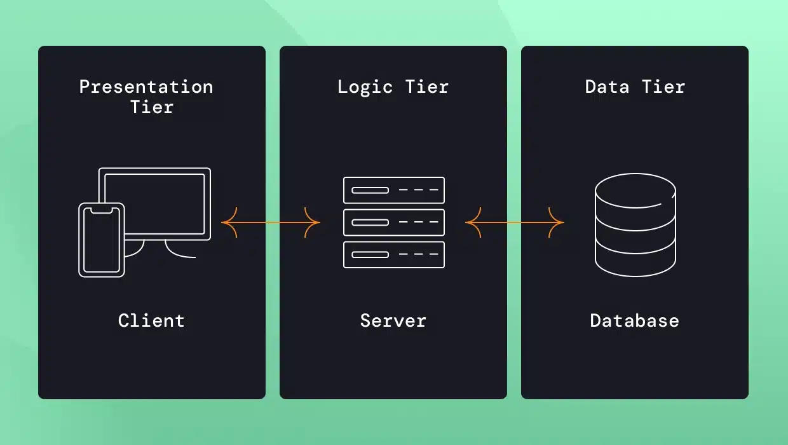

# 🗃️ Week 4: Introduction to Databases and APIs  
*#databases #api #backend #webdevelopment*

So far, your websites can **show content**, **look good**, and **respond to user actions**. But what if you want to **store information** — like user data, form results, or blog posts?

And what if you want your site to **get data from another website** — like weather, news, or Google Maps?

Welcome to the world of **Databases and APIs**! 🌐💾

---

## 🧠 Part 1: What is a Database?

A **database** is a digital place where data is **stored**, **organized**, and **retrieved**.

### 📦 Simple Analogy:  
Imagine a **spreadsheet** with rows and columns. Each row = one record. Each column = a property (name, age, etc.).  
Databases are like powerful, searchable versions of spreadsheets.

---

### 📊 Why Use Databases?

- Store user registrations  
- Save blog posts or comments  
- Keep inventory or product data  
- Remember your app’s state

---

### 🧱 Types of Databases

1. **SQL Databases** (Structured)
   - Examples: MySQL, PostgreSQL, SQLite
   - Data stored in **tables** (rows & columns)
   - You use **SQL language** to interact with them  
   Example:  
   ```sql
   SELECT * FROM users WHERE age > 18;
    ```

2.	NoSQL Databases (Flexible)
    - Examples: MongoDB, Firebase
    - Data stored in documents or key-value pairs
    - Easier to scale for some apps
    Example (MongoDB-style):
    ```json
    {
      "name": "Alice",
      "age": 25,
      "interests": ["coding", "music"]
    }
    ```

For now, it’s enough to know what they are and that your app can connect to a database to save and load data.


## 🧠 Part 2: What is an API?

API stands for Application Programming Interface.
An API is like a menu in a restaurant. It tells you what you can ask for — and how.

You don’t need to know how the kitchen works — you just need to place the right order!

---

### 🧾 Real-World Analogy:
When you use a weather app, it doesn’t store all the weather data. It asks a weather API:

- “Hey, what’s the weather in Almaty today?”

And the API replies:

- “Sunny, 23°C 🌞”

### 📡 Why Use APIs?
- Get data from other websites (like weather, news, etc.)
- Send data to other services (like forms, payments, etc.)
- Connect your app to external services (like Google Maps, Twitter, etc.)
- Save time by reusing powerful tools instead of building everything from scratch

### 🧪 What Does an API Response Look Like?
APIs usually send back data in a format called JSON (JavaScript Object Notation).

Example:
```json
{
  "location": "Almaty",
  "temperature": 23,
  "condition": "Sunny"
}
```

### 🛠️ How to Use an API?
To use an API, you typically make a request using JavaScript (or another programming language). Here’s a simple example using JavaScript's `fetch` function:
```javascript
fetch("https://api.example.com/weather/almaty")
  .then(response => response.json())
  .then(data => {
    console.log("Temperature is", data.temperature);
  });
```

### 🧩 How does it all work?
 
- [This is very good article](https://vfunction.com/blog/3-tier-application/) about 3-tier architecture.

## Practical Example
* Install PostgreSQL on your computer (google "PostgreSQL download" for your OS)
* Create new dataabse called `myapp`
* Then run script to create a table:
```sql
-- Connect to your database and run:
CREATE TABLE items (
    id SERIAL PRIMARY KEY,
    name TEXT
);

INSERT INTO items (name) VALUES ('Item 1'), ('Item 2');
```
* Now you can use this database in your app!
* Create a file called server.js:
```javascript
import express from 'express';
import pg from 'pg';

const app = express();
const port = 3000;

// Database config
const pool = new pg.Pool({
  user: 'postgres',         // change if needed
  host: 'localhost',
  database: 'myapp',
  password: 'your_password', // change to your password
  port: 5432,
});

// Middleware to parse JSON
app.use(express.json());

// GET items
app.get('/items', async (req, res) => {
  try {
    const result = await pool.query('SELECT * FROM items');
    res.json(result.rows);
  } catch (err) {
    console.error(err);
    res.status(500).send('Server error');
  }
});

// POST item
app.post('/items', async (req, res) => {
  const { name } = req.body;
  try {
    const result = await pool.query(
      'INSERT INTO items (name) VALUES ($1) RETURNING *',
      [name]
    );
    res.json(result.rows[0]);
  } catch (err) {
    console.error(err);
    res.status(500).send('Server error');
  }
});

app.listen(port, () => {
  console.log(`Server running on http://localhost:${port}`);
});
```
* install dependencies:
```bash
npm init -y
npm install express pg
```
* Run your server:
```bash
node server.js
```
* Now you can open your browser and open Dev Tools (F12) and go to the Console tab.
* Run this code to fetch items from your database:
```javascript
// Fetch items
fetch('http://localhost:3000/items')
  .then(res => res.json())
  .then(console.log);

// Add a new item
fetch('http://localhost:3000/items', {
  method: 'POST',
  headers: { 'Content-Type': 'application/json' },
  body: JSON.stringify({ name: 'New Item' })
})
  .then(res => res.json())
  .then(console.log);
```

This is very basic example, but it shows how you can connect your app to a database and use an API to interact with it.

## 🧪 Homework
1. Think of 3 things your future app could store in a database. 
   (e.g., Tasks, User names, Game scores)
2. Visit a public API listing 
    (e.g., https://publicapis.dev or https://rapidapi.com, https://jsonplaceholder.typicode.com/)
- Search for an API you’d like to try (e.g., dog facts, quotes, weather)
1. Bonus Challenge 💡:
- Try copying a fetch() example and running it in your browser’s dev tools (open with F12, go to Console)
- Modify the example to fetch data from a different API you found

## 📝 Resources
- [W3Schools SQL Tutorial](https://www.w3schools.com/sql/)
- [Fetch API](https://developer.mozilla.org/en-US/docs/Web/API/Fetch_API)
- [JSON Placeholder (Fake Online REST API)](https://jsonplaceholder.typicode.com/)
- [Node JS & PostgreSQL полный курс 2021 Rest API](https://www.youtube.com/watch?v=p3RFMEixUOE&ab_channel=UlbiTV)