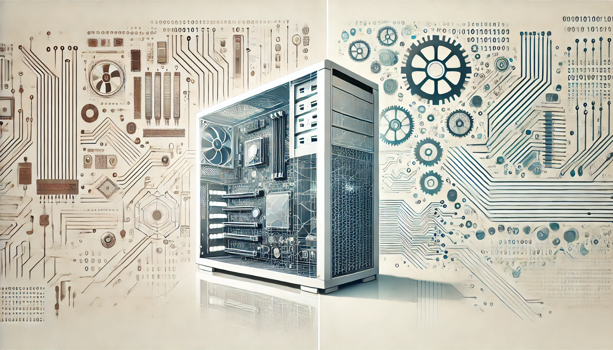
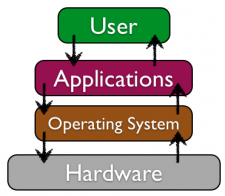

# Week 1: Introduction to Computers 💻

Welcome to your first week of Season 1! Let’s start by understanding the very basics of what makes a computer tick. Whether you’re learning this to start a new career or just to satisfy your curiosity, getting familiar with these fundamentals will help you feel more comfortable as we move into more complex topics.

## 1. How Computers Work
A computer follows a cycle: it takes input, processes it, then produces output and stores results.  

	•	Input: You type on a keyboard or click with a mouse.
	•	Process: The computer’s processor interprets and executes instructions.
	•	Output: You see results on the screen or hear sounds through speakers.
	•	Storage: Data is saved for later use, so you don’t lose your work.

To make this flow working, computer has to integrate 
hardware and software into a coherent unit.

## 2. Hardware vs. Software
	•	Hardware: These are the physical components you can touch—like the keyboard, mouse, monitor, and the computer’s internal parts (CPU, RAM, hard drive). Think of hardware as the “body” of the machine.
	•	Software: This is the “brain” or instructions that tell the hardware what to do. Software includes the operating system (like Windows, macOS, or Linux) and applications (like web browsers, word processors, or games).

## 3. Hardware: Key Components Inside the Computer
	•	CPU (Central Processing Unit): Often called the “brain” of the computer, the CPU performs calculations, interprets instructions, and runs programs. Its speed is measured in GHz (gigahertz), indicating how many operations it can handle per second.
	•	Memory (RAM): This is the computer’s short-term memory. It stores data and instructions currently in use so the CPU can quickly access them. The more RAM you have, the more programs you can run smoothly at the same time.
	•	Storage: Devices like hard drives (HDD) or solid-state drives (SSD) serve as long-term memory. They keep your files, applications, and operating system safe even when the computer is off. SSDs are generally faster but often more expensive than HDDs.

## 4. Software
Software is a set of instructions that tells the computer what to do. It’s divided into two main categories:

    •	System Software: This includes the operating system (like Windows, macOS, or Linux) and utility programs that help manage the computer’s resources. The operating system controls hardware and software, manages files, and provides a user interface.
    •	Application Software: These are programs that perform specific tasks, like word processing, web browsing, or gaming. Application software runs on top of the operating system and interacts with the hardware through it.

## Why Does This Matter?
Hardware and software work together like a team: the hardware provides the physical components that do the “heavy lifting,” while the software gives them instructions on what to do. Think of hardware as the machine’s body—its processor, memory, and storage—and software as its brain, delivering a set of rules and commands. When you click a button in a program (software), the CPU (hardware) carries out the instructions to display something on your screen. In essence, software tells the hardware how to function, and the hardware makes the software’s ideas a reality.

Understanding these basic concepts will give you the confidence to navigate the tech world. You’ll know what’s going on under the hood when your computer boots up, when you install new software, or when you add more RAM to improve performance. As we move forward, we’ll build on these fundamentals, exploring operating systems, networks, and more.

## The Focus of This Course:
While hardware forms the foundation, it’s the **SOFTWARE** that makes your computer truly useful. By understanding software, you can learn how programs are written, how they communicate with your computer’s components, and how to improve or customize your digital environment. This knowledge will not only help you troubleshoot common issues but also give you the building blocks to create software of your own as you advance in your IT journey.

## Next Steps:
    •   Links:
        •   [Модель OSI – это просто](https://wiki.merionet.ru/articles/model-osi-eto-prosto)
        •   [Программное обеспечение компьютера, состав и структура. Назначение операционной системы.](https://vplaksina.narod.ru/uchebnik/po.htm)
	•	Think about your own device: Can you identify the CPU, RAM, and storage type your computer uses?
	•	Stay tuned for Week 2, where we’ll dive deeper into Operating Systems and learn to navigate Windows, macOS, and Linux with confidence!